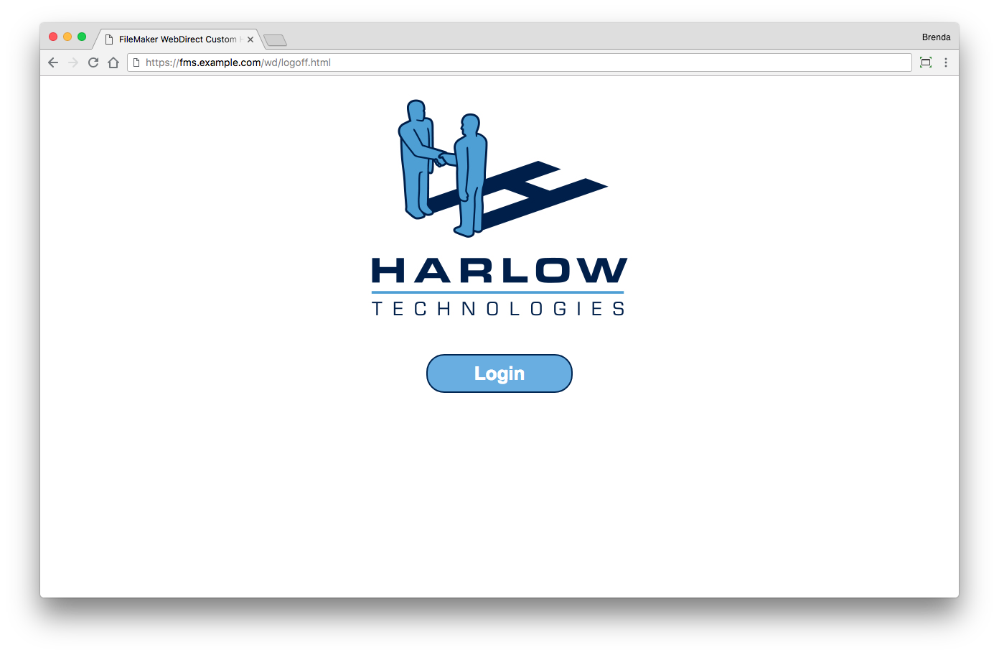
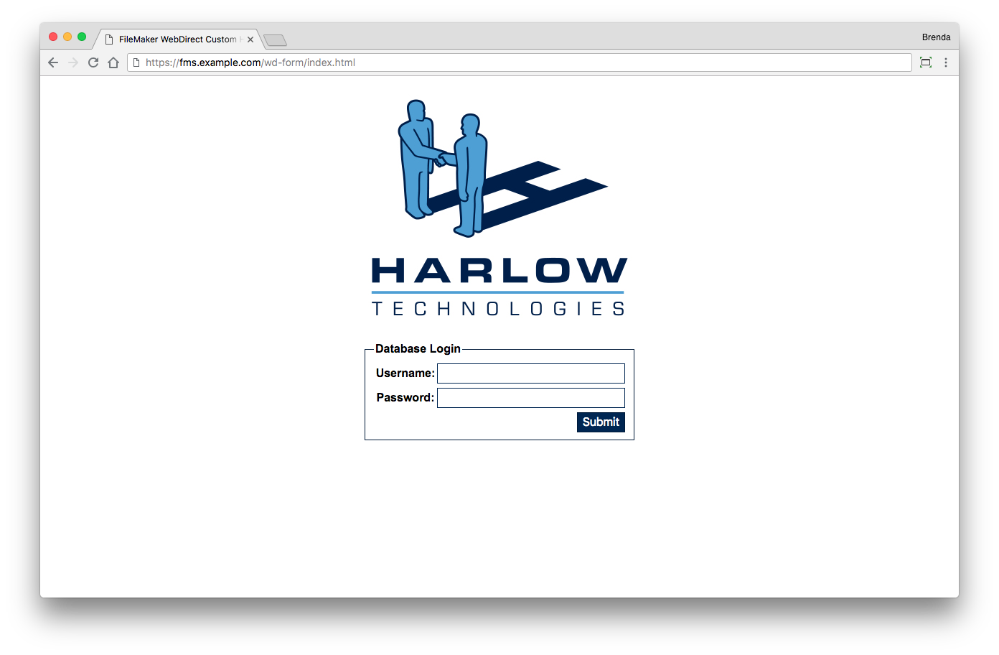
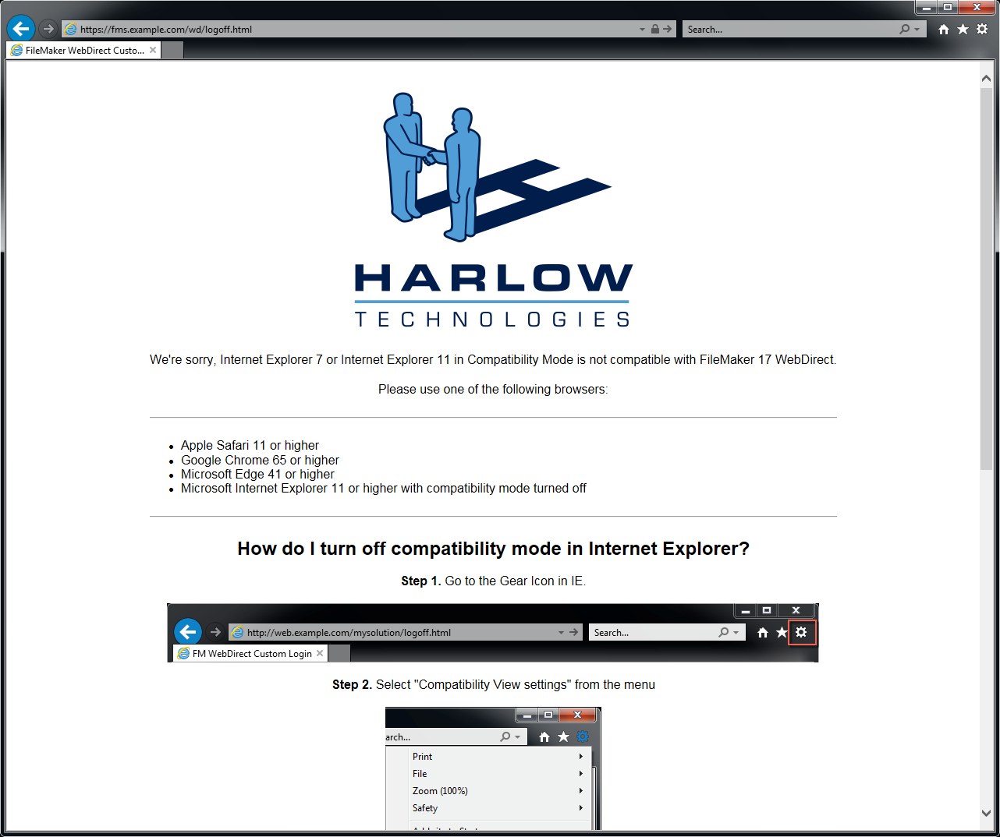

# FileMaker WebDirect Custom Homepage Examples #

The Harlow Technologies logo design is the exclusive property of Harlow Technologies Inc. and is Copyright (c) 2018 Harlow Technologies Inc. All rights reserved.

## Basic Screen Look and Feel ##

The basic page for the custom homepage should have a logo and a button that will take the user to the login screen. This screen is configurable by modifying the logo file, image tag and the styles.css for your colors / style.

Note, the index.html page does have an automatic redirection script. If you do not want it, you can comment it out so both pages will appear as the image below.

## Form Login Look and Feel ##

The form login page for the custom home page should have a logo and a form with username and password. This screen is configurable by modifying the logo file, image tag and the styles.css for your colors / style.

## Invalid Browser Version ##

If a user attempts to use a browser that is not valid for WebDirect, then the JavaScript should catch it and display some error information that includes the required minimum browser version.

## Invalid Internet Explorer Version ##

If a user attempts to use Internet Explorer that is either older or has compatibility mode turned on, then a special error message appears informing the user how to turn it off.

