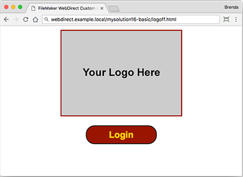
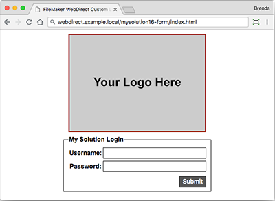

# Claris FileMaker WebDirect Custom Homepage #

This repository has been provided by [Harlow Technologies Inc.](http://www.harlowtech.com) as a service to the FileMaker community in making Claris FileMaker WebDirect logins for our customers easier.

Below are the instructions for how to install and configure the HTML pages for custom FileMaker WebDirect login, logoff and form pages.

 

## Installation ##

* Install Instructions
* Web Directory Root Folder
* How to Download these Files

### Install Instructions ###

1. After downloading the files, look inside the folder titled "html"
2. Select the folder for the version you need then open the index.html and logoff.html in a text editor for that Version.
    * FileMaker 13 = mysolution13
    * FileMaker 14 = mysolution14
    * FileMaker 15 = mysolution15
    * FileMaker 16 = mysolution16-basic or mysolution16-form
    * FileMaker 17 = mysolution17-basic or mysolution17-form
    * FileMaker 18 = mysolution18-basic or mysolution18-form
    * FileMaker 19 = mysolution19-basic or mysolution19-form
3. On both files, make the following adjustments:
    1. If you are using https, update the url protocol to https from http on both the URL and URL parameter “homeurl”.
    2. Update the web host (example: fms.example.com) to the host name or IP you wish to use for the FileMaker Server.
    3. Update the web host (example: web.example.com) to the host name or IP you wish to use for URL parameter "homeurl"
    4. Update the folder name to the folder name you wish to use on the web server in the URL parameter "homeurl" for the logoff page.
    5. Update the database name in the URL
        * For FileMaker 15 or earlier, update the database name after the # sign in the URL parameter "homeurl"
        * For FileMaker 16 or later, update the database name after "fmi/webd/" in the URL "homeurl"
4. Place the folder on the web server root folder and provide the user with the URL to the index.html file.
5. Give the user your adjusted URL to start using FileMaker WebDirect with a custom home page Example: http://web.example.com/mysolution/index.html

### Web Directory Root Folder ###

The typical web server root folders for FileMaker Server can be found at:

__For IIS (Windows) through HTTP or HTTPS__

* [drive]:\Program Files\FileMaker\FileMaker Server\HTTPServer\conf
* Where [drive] is the drive on which the Web Publishing Engine component of your FileMaker Server deployment resides.

__For Apache (OS X) through HTTP__

* /Library/FileMaker Server/HTTPServer/htdocs

__For Apache (OS X) through HTTPS__

* /Library/FileMaker Server/HTTPServer/htdocs/httpsRoot

### How to Download these Files ###

Want to download and try these files out with your solution. Look for the "Clone or download" button at the on the top of the [GitHub](https://github.com/bharlow/fm-webdirect-custom) page.

## Bugs ##

On the HTTP Form Post method, there appears to be a bug in FileMaker Server (versions prior to 19) when a user logins with the incorrect credentials. The FileMaker Server appears to append the server URL before the full request URL, which results in an invalid domain name. **This appears to be resolved in FileMaker 19, but remains in FileMaker 16 - 18.**

### Example Request URL for HTTP Post to FileMaker ###

https://fms.example.com/fmi/webd/webd-example?homeurl=https://web.example.com/webd-custom/index.html

### Example Response URL for HTTP Post from FileMaker ###

https://fms.example.comhttps://web.example.com/webd-custom/index.html?homeurl=https://web.example.com/webd-custom/index.html&db=webd-example&loginerr=212&guesten=0

## Tips and Hints ##

* When you update the web host or folder name the index.html needs to have it updated in two locations while the logoff.html only has one location.
* The URL Host Name or IP for the FileMaker Server can be different than the homeurl URL Host Name or IP. You must be sure to link the pages up appropriately.
* All of the files listed in the folder inside the *html* folder are designed to be used at either the root of the web server or in a folder name of your choosing.
* As of FileMaker 16, the url fragment character "#" is no longer supported. See [Miscellaneous behavior changes in FileMaker 16 Platform](http://help.filemaker.com/app/answers/detail/a_id/16316).
* Microsoft Edge has two versions numbers that must be factored in, the Version of the Browser "38" and the Version of EdgeHTML "14.14342". Browser detection must check against EdgeHTML. See [Wikipedia - Microsoft Edge Release History](https://en.wikipedia.org/wiki/Microsoft_Edge#Release_history) to translate the version FileMaker requires to the version the browser detection requires.
* For FileMaker version 18 and prior, Microsoft Internet Explorer has a mode where Intranet sites are placed in compatibility mode. This by default sets the browser to behave as if it is IE 7 rather than IE 10 or 11. Notes with how to turn this mode off have been added to the HTML pages.
* For FileMaker version 19 or later, Microsoft Internet Explorer is no longer supported.
* Some web servers allow both HTTP and HTTPS access to the same pages. If this is the case, it is best if you can force the user to use HTTPS at the web server level. If this cannot be done, you can leverage an optional JavaScript to check and force a user to HTTPS.

## Examples ##

For examples of how the [basic login screens appear](EXAMPLES.md) visit our example markdown file.

## Official Documentation ##

Official documentation on using the WebDirect custom homepage that can be found at:
* [FileMaker 13 WebDirect PDF - Starting at Page 26](https://fmhelp.filemaker.com/docs/13/en/fm13_webdirect_guide.pdf#page=26) 
* [FileMaker 14 WebDirect PDF - Starting at Page 28](https://fmhelp.filemaker.com/docs/14/en/fm14_webdirect_guide.pdf#page=28) 
* [FileMaker 15 WebDirect PDF - Starting at Page 27](https://fmhelp.filemaker.com/docs/15/en/fm15_webdirect_guide.pdf#page=27) 
* [FileMaker 16 WebDirect Website](https://fmhelp.filemaker.com/docs/16/en/fmwd/)
* [FileMaker 17 WebDirect Website](https://fmhelp.filemaker.com/docs/17/en/fmwd/)
* [FileMaker 18 WebDirect Website](https://fmhelp.filemaker.com/docs/18/en/fmwd/)
* [FileMaker 19 WebDirect Website](https://help.claris.com/en/webdirect-guide/)

## Change Notes ##

* Version 0.0: 05/14/2014 - Initial Creation and deployment
* Version 1.0: 07/24/2014 - Addition of JavaScript Redirect to index.html
* Version 1.1: 07/22/2015 - Moved Styles to their own styles.css file
* Version 1.2: 03/09/2016 - Added Meta Tags for Caching and Robots
* Version 1.3: 03/23/2016 - Added JavaScript Browser Detection to help prevent browsers not compatible with WebDirect from using it
* Version 2.0: 04/08/2018
  * Created FileMaker specific version specific folders called: mysolution13, mysolution14, mysolution15, mysolution16-basic.
  * Removed the mysolution folder.
  * Updated for FileMaker 16 changes to WebDirect URL Structure
  * Removed Browser Detection https://github.com/darcyclarke/Detect.js due to no longer being maintained
  * Added Browser Detection https://github.com/lancedikson/bowser
  * Updated Copyright
* Version 2.1: 05/31/2018 - Adjusted for EdgeHTML Version on browser check vs display of Edge Browser Version; Added FM 17 Info
* Version 2.2: 06/05/2018 - Added IE 10 & 11 in Compatibility Mode error message.
* Version 2.3: 06/12/2018 - Added example screenshots for how screens can look on a web server.
* Version 2.4: 06/13/2018 - Added Login Form version of custom login screens for FileMaker 16 and 17.
* Version 2.5: 06/25/2018 - Added an optional JavaScript to force HTTPS for servers that allow the user to access HTTP and HTTPS versions of the site.
* Version 2.6: 07/11/2020
  * Added FM 18 and FM 19 versions.
  * Updated browser detection to Bowser 2 for FM 18 & 19 due to new browser requirements.
  * Updated URL's for claris.com for some URLs
  * Updated Copyright.

## Copyright ##

The Harlow Technologies logo design is the exclusive property of Harlow Technologies Inc. and is Copyright (c) 2018 Harlow Technologies Inc. All rights reserved.

Copyright (c) 2016-2020 Harlow Technologies Inc.

* Released under the MIT license
* https://github.com/bharlow/fm-webdirect-custom/blob/master/LICENSE.txt

FileMaker is a trademark of FileMaker, Inc., registered in the U.S. and other countries. FileMaker WebDirect is a trademark of FileMaker, Inc.

Detect.js: User-Agent Parser (https://github.com/darcyclarke/Detect.js) is Dual licensed under the MIT and GPL licenses.

* Added v1.3
* Removed v2.0

Bowser: User-Agent Parser (https://github.com/lancedikson/bowser) is licensed under the MIT license.

* Added v2.0
* Updated v2.6
